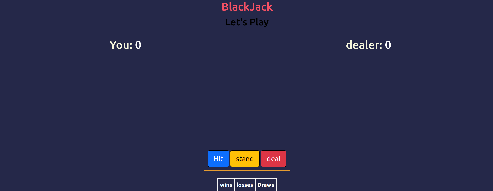

# 🃏 BlackJack Game 🎰

<p align="center">
  
</p>


## 🔥 Live Demo
👉 **[Hier spielen!](https://blackjack-b842.onrender.com)**

---

## 📌 Beschreibung

Ein interaktives **BlackJack-Spiel**, das mit HTML, CSS und JavaScript entwickelt wurde. Spiele gegen den Computer, setze Chips und verbessere deine Strategie!

---

## 🚀 Features

✅ **Klassisches BlackJack-Spiel mit Animationen**  
✅ **Soundeffekte für realistische Spielerfahrung**  
✅ **Einfache Spielsteuerung**  
✅ **Modernes Design mit CSS & JavaScript**  

---

## 🛠️ Technologien

- **HTML** - Struktur der Spielseite
- **CSS** - Styling und Animationen
- **JavaScript** - Spielmechanik und Logik

---

## 📂 Projektstruktur

```bash
BlackJack/
│── Static/             # Statische Dateien (CSS, JS, Sounds, Bilder)
│   ├── Images/         # Bilder für das Spiel
│   ├── sounds/         # Soundeffekte (cash, swish, aww)
│   ├── index.js        # Haupt-JavaScript für das Spiel
│   ├── index.css       # Haupt-Stylesheet
│── index.html          # Hauptseite des Spiels
│── README.md           # Dokumentation
│── LICENSE             # Lizenzdatei
```

---

## 🚀 Installation & Nutzung

1️⃣ **Repository klonen**  
```sh
git clone https://github.com/dein-github/BlackJack.git
cd BlackJack
```

2️⃣ **Spiel im Browser öffnen**  
```sh
start index.html
```

Oder du ziehst die `index.html`-Datei in einen Browser.

---

## 📧 Kontakt

📩 **E-Mail:** Alirezarezairad5@gmail.com  
💼 **LinkedIn:** [Dein LinkedIn-Profil](https://linkedin.com/in/Alirezarezairad)  
🐙 **GitHub:** [Dein GitHub-Profil](https://github.com/Alirezarezairad)  

---

**📝 Lizenz**  
Dieses Projekt ist unter der MIT-Lizenz veröffentlicht. Siehe [LICENSE](LICENSE) für Details.

---

⭐️ **Vergiss nicht, das Repository zu ⭐starren, wenn dir das Projekt gefällt!** 🚀
